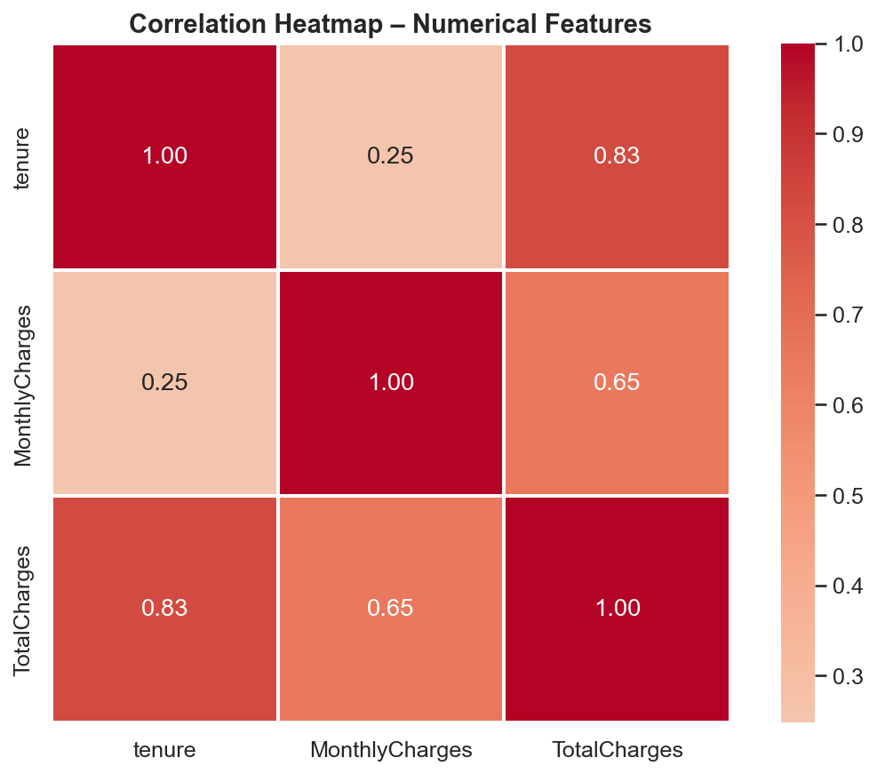

# Churn Intelligence


A production-ready telco customer churn prediction system built with XGBoost and FastAPI — deployed via Docker on Render.

🔗 **Live Demo:** https://churn-intelligence-bzs3.onrender.com/

---

## What it does

Predicts the probability that a telecom customer will churn, assigns a risk tier (Low / Medium / High), and recommends a retention action. Supports both single-customer predictions via a web dashboard and bulk predictions via CSV/Excel upload.

---

## Tech stack

| Layer | Technology |
|---|---|
| Model | XGBoost + SMOTE (imbalanced-learn) |
| API | FastAPI + Pydantic v2 |
| Serving | Uvicorn |
| Frontend | Vanilla HTML/CSS/JS |
| Containerisation | Docker |
| Deployment | Render |

---

## Project structure

```
churn/
├── app/
│   ├── __init__.py
│   ├── main.py          # FastAPI application and endpoints
│   ├── predict.py       # Inference logic — single and batch
│   ├── utils.py         # Feature engineering
│   └── static/
│       └── index.html   # Dashboard UI
├── assets/              # EDA plots and images for README
│   ├── 01_churn_distribution.png
│   ├── 02_numerical_distributions.png
│   └── 04_correlation_heatmap.png
├── model/
│   └── churn_pipeline.joblib   # Trained pipeline artifact
├── notebooks/
│   └── eda.ipynb        # Exploratory analysis and model development
├── Dockerfile
├── requirements.txt
├── pyproject.toml
└── train.py             # Training script
```

---

## API endpoints

| Method | Endpoint | Description |
|---|---|---|
| GET | `/` | Dashboard UI |
| GET | `/health` | Model readiness check |
| POST | `/predict/single` | Single customer prediction (JSON) |
| POST | `/predict/batch` | Batch prediction (CSV / Excel upload) |

Full interactive docs available at `/docs` once running.

---

## Model details

- **Algorithm:** XGBoost classifier wrapped in a scikit-learn pipeline
- **Class imbalance:** Handled with SMOTE (applied only on training folds)
- **Features:** 19 raw features + 4 engineered (`avg_monthly_spend`, `is_new_customer`, `is_high_value`, `has_support_services`)
- **Preprocessing:** Separate pipelines for numerical (impute + scale), binary (ordinal encode), and multi-category (one-hot encode) columns
- **Artifact:** Versioned with training timestamp, dataset hash, and test metrics — no silent model drift

**Note:** Probability calibration (`CalibratedClassifierCV`) is on the roadmap. Current risk thresholds (30% / 60%) are applied to raw XGBoost probabilities.

---

## Learnings, challenges & decisions

This section documents what I learned, the problems I ran into, and the decisions I made — mostly for my own reference but also for anyone curious about the thought process behind the project.

### What I learned

- **ML pipelines with scikit-learn** — building separate preprocessing pipelines for numerical, binary, and categorical features and chaining them with the model into a single `.joblib` artifact. This made inference clean and consistent with training.
- **Handling class imbalance with SMOTE** — the dataset had a 73/27 churn split. I learned that SMOTE must only be applied inside training folds, not on the full dataset before splitting, to avoid data leakage.
- **Feature engineering** — derived four new features (`avg_monthly_spend`, `is_new_customer`, `is_high_value`, `has_support_services`) from the raw columns. This was my first time deliberately engineering features rather than just feeding raw data to the model.
- **Building REST APIs with FastAPI** — learned how to structure endpoints, validate request payloads with Pydantic, and handle both single and batch prediction flows.
- **Logging** — added logging throughout the API: when the model loads at startup, when a prediction request comes in, what HTTP method and endpoint was hit, and when errors occur. This was genuinely useful during development — without it I had no idea what was happening inside the container.
- **Docker & containerisation** — wrote a Dockerfile from scratch, understood the difference between build-time and runtime, and learned how to expose and map ports correctly.
- **Deploying on Render** — connected the GitHub repo to Render, let it auto-detect the Dockerfile, and configured the port. First time deploying an ML model as a live API.

---

### Problems I faced & decisions I made

**1. Model selection — Random Forest vs XGBoost**

I wasn't sure whether to go with a tuned Random Forest or XGBoost with hyperparameter tuning. I hadn't used XGBoost before and chose it mostly to learn something new. In hindsight, benchmarking both properly would have been the right approach — that's now on the roadmap.

**2. Overfitting**

The model was performing too well on training data relative to validation. I addressed this with cross-validation to get a more honest estimate of generalisation performance, rather than relying on a single train/test split.

**3. Feature correlation (`TotalCharges` vs `tenure`)**

These two features had a 0.83 correlation — high enough to cause redundancy. I decided to drop `TotalCharges` and keep `tenure` and `MonthlyCharges` instead. The intuition: tenure tells you *how long* a customer has stayed, monthly charges tells you *how much* they pay — together they capture the signal that `TotalCharges` carried, without the redundancy.

**4. Data preprocessing**

The dataset had mixed data types (numerical, binary yes/no columns, and multi-category string columns), missing values, and needed different encoding strategies per column type. I built three separate preprocessing pipelines and combined them with `ColumnTransformer` — this was the most time-consuming part of the project.

---

### Churn distribution


The dataset is imbalanced — 73.5% of customers did not churn vs 26.5% who did (5,174 vs 1,869 customers). This imbalance is the reason SMOTE was applied during training to prevent the model from being biased towards predicting "No Churn" for every customer.

---

### Numerical feature distributions


Three clear patterns emerge:
- **Tenure** — churned customers are heavily concentrated in the first few months. Long-tenure customers rarely churn.
- **MonthlyCharges** — churned customers skew towards higher monthly bills ($60–$100 range).
- **TotalCharges** — churned customers have low total charges, consistent with them leaving early.

---

### Correlation heatmap


`TotalCharges` and `tenure` are strongly correlated (0.83) — expected, since total charges accumulate over time. This informed the `avg_monthly_spend` engineered feature (`TotalCharges / (tenure + 1)`), which captures spending rate independently of how long a customer has been with the company.

---

## Prerequisites

- Python 3.10+
- pip
- Docker (optional, for containerised run)

---

## How to run locally

**1. Clone the repo:**
```bash
git clone https://github.com/your-username/churn-intelligence.git
cd churn-intelligence
```

**2. Install dependencies:**
```bash
pip install -e .
pip install -r requirements.txt
```

**3. Train the model:**
```bash
python train.py
```

**4. Start the server:**
```bash
uvicorn app.main:app --reload
```

**5. Open the dashboard:**
```
http://localhost:8000
```

**Or with Docker:**
```bash
docker build -t churn-intelligence .
docker run -p 10000:10000 churn-intelligence
```

---

## Roadmap

- [ ] Focus on generating an explanation using LLM and SHAP
- [ ] Probability calibration — `CalibratedClassifierCV` (isotonic) + threshold validation
- [ ] Unit tests for feature engineering, schema validation, and inference
- [ ] Cross-validation instead of single train/test split
- [ ] CI/CD — GitHub Actions to run tests on every push

---

## License

MIT
